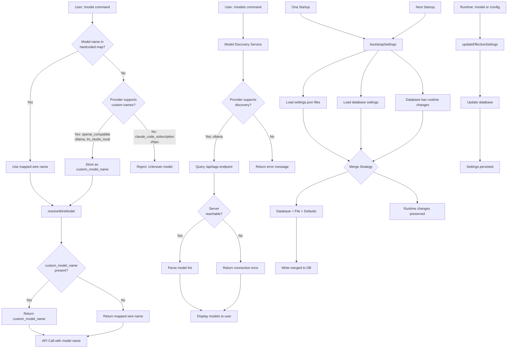
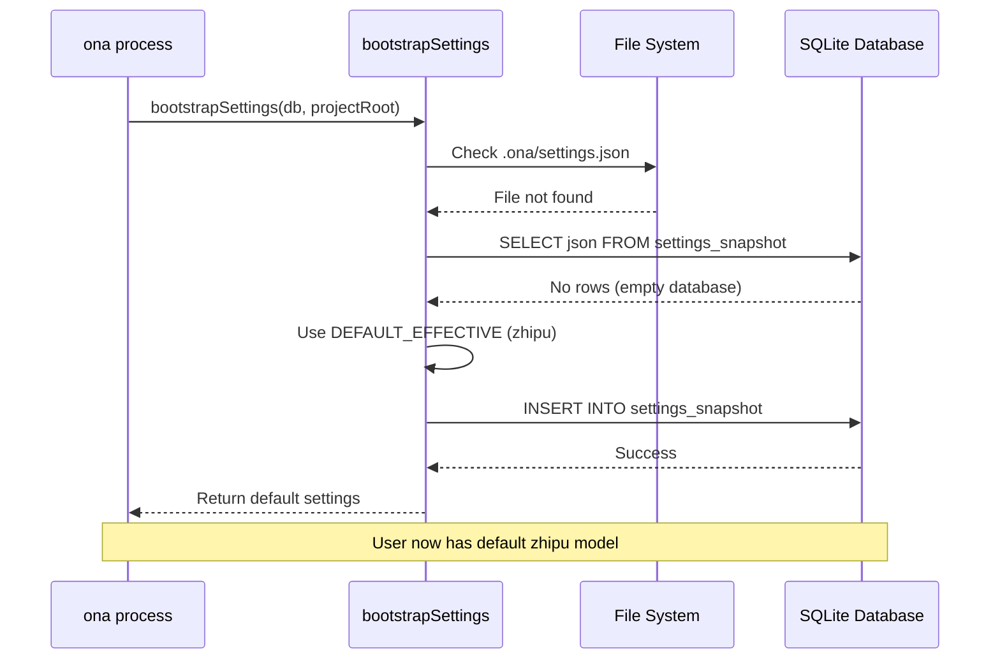
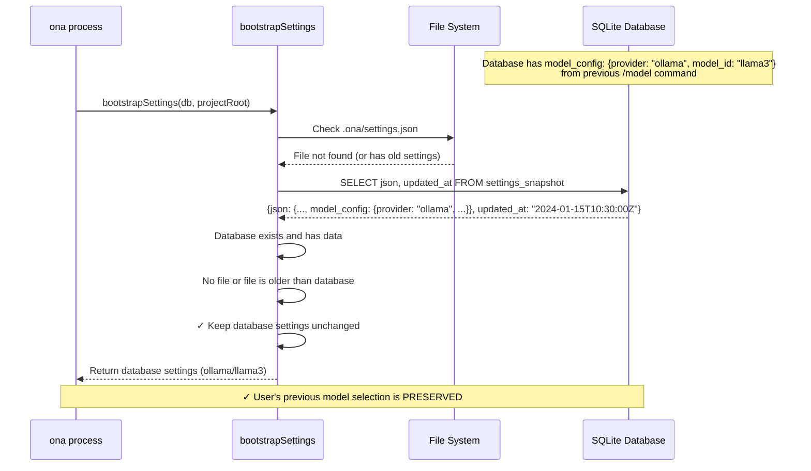
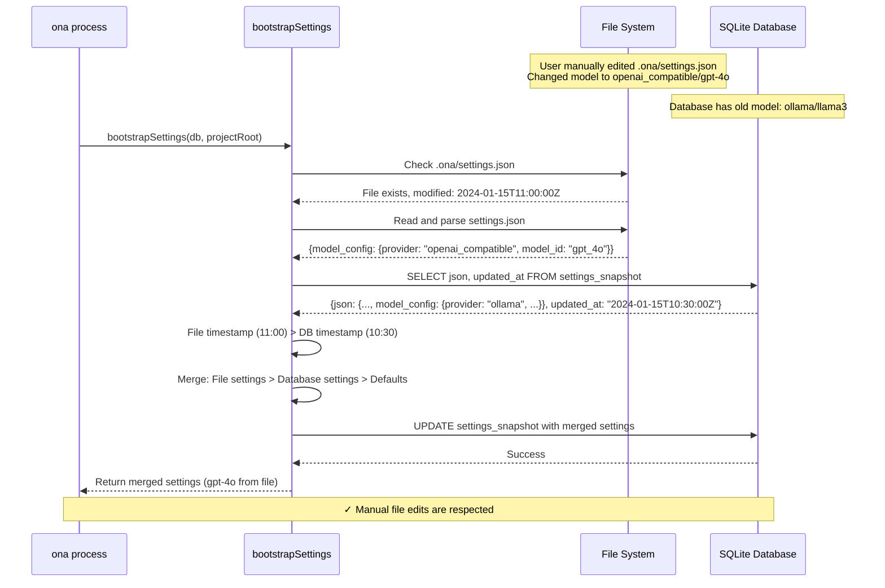
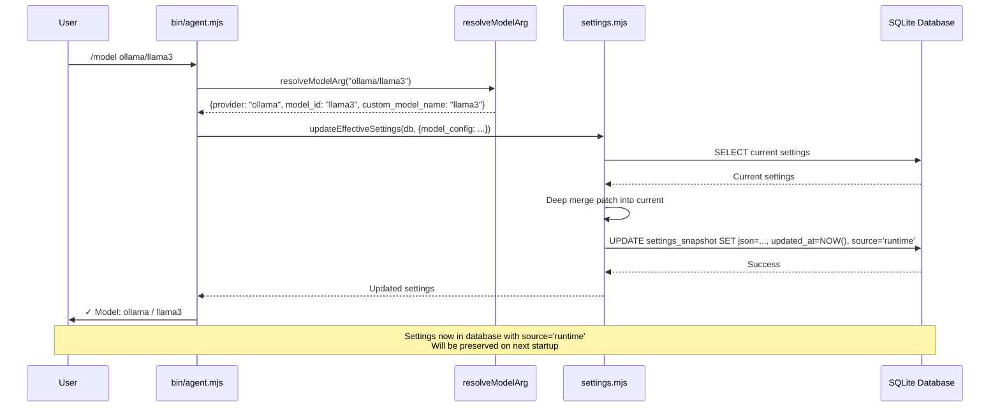
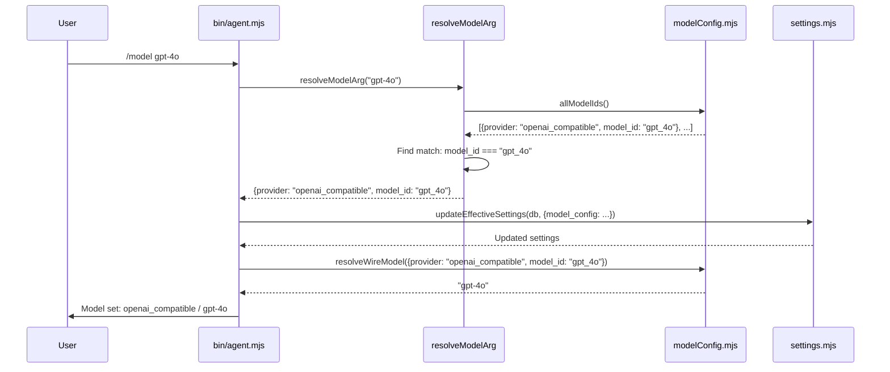
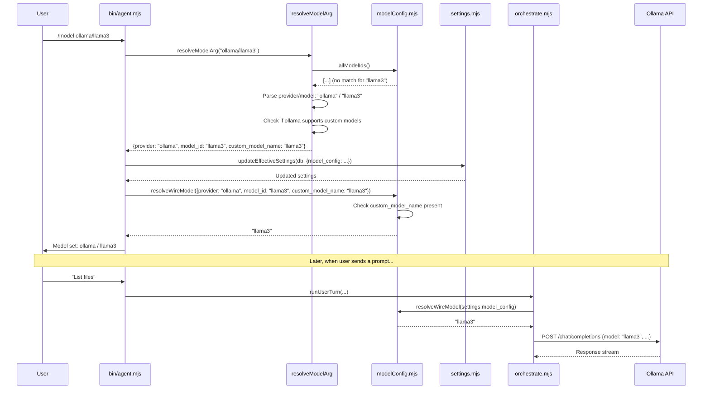
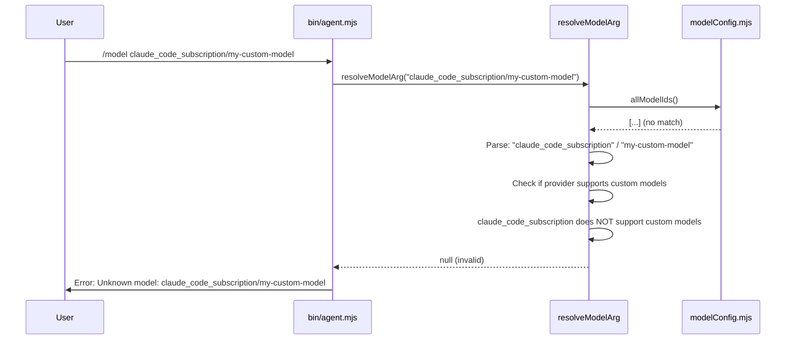
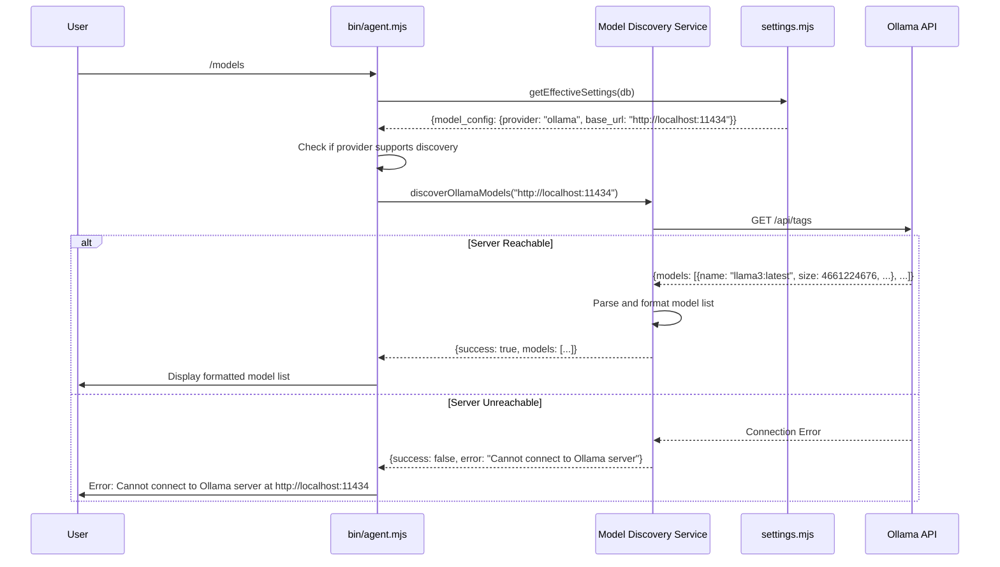
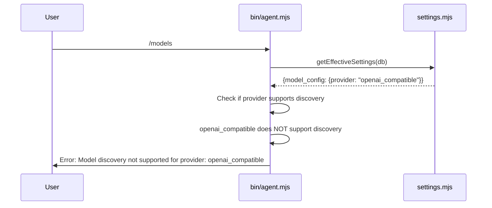

# Design Document: Flexible Ollama Model Support

## Overview

Enable the `openai_compatible` provider to work seamlessly with Ollama servers by supporting custom/arbitrary model names without requiring hardcoded entries in `modelConfig.mjs`. This removes the current workaround where users must use the `lm_studio_local` provider path with environment variables to access their Ollama models.

The solution introduces three key capabilities:
1. **Custom Model Names**: A `custom_model_name` field in the model configuration that, when present, bypasses the hardcoded model validation and uses the custom name directly in API calls.
2. **Model Discovery**: A new `/models` command that queries the Ollama API's `/api/tags` endpoint to list available models on the configured server, eliminating the need for users to know exact model names.
3. **Persistent Settings**: A merge-based settings persistence strategy that preserves runtime changes (like `/model` selections) across ona restarts, fixing the critical bug where settings are overwritten on every startup.

This approach maintains backward compatibility while enabling flexible model selection for local-first users and improving the user experience through automatic model discovery and reliable persistence.

## Architecture



## Persistence Architecture

### Current Problem

**Startup Flow (BROKEN)**:
```
1. ona starts → bootstrapSettings() called
2. Reads .ona/settings.json (or defaults to zhipu)
3. Does INSERT OR REPLACE into settings_snapshot table
4. ❌ OVERWRITES any previous runtime changes from /model command
5. User's model selection from last session is LOST
```

**Runtime Flow (WORKS)**:
```
1. User runs /model ollama/llama3
2. updateEffectiveSettings() called
3. Updates settings_snapshot table
4. ✓ Model selection active for current session
```

**Next Startup (BROKEN AGAIN)**:
```
1. ona starts → bootstrapSettings() called again
2. Reads .ona/settings.json (still has old/default model)
3. Does INSERT OR REPLACE into settings_snapshot table
4. ❌ OVERWRITES the llama3 selection from previous session
5. User must re-select model EVERY TIME
```

### Solution: Merge-Based Persistence

**New Startup Flow (FIXED)**:
```
1. ona starts → bootstrapSettings() called
2. Reads .ona/settings.json files (if they exist)
3. Reads EXISTING database settings_snapshot
4. ✓ MERGES with precedence: Database > File > Defaults
5. Only writes to DB if database was empty or file is newer
6. Runtime changes from previous session are PRESERVED
```

**Precedence Rules**:
- **Database settings** (from previous runtime changes) take highest priority
- **File settings** (from .ona/settings.json) take medium priority
- **Default settings** (hardcoded) take lowest priority

**When to Update Database**:
- Database is empty (first run) → Write merged settings
- File timestamp is newer than database timestamp → Merge file changes into database
- Otherwise → Keep database settings unchanged (preserve runtime changes)

## Components and Interfaces

### Component 1: Settings Persistence Manager

**Purpose**: Manage settings lifecycle with merge-based persistence strategy

**Interface**:
```javascript
function bootstrapSettings(db, projectRoot): SettingsObject
function getEffectiveSettings(db): SettingsObject
function updateEffectiveSettings(db, patch): SettingsObject
function getSettingsMetadata(db): { updated_at: string, source: string }
function getFileModificationTime(filePath): Date | null
```

**Responsibilities**:
- Load settings from multiple sources (files, database, defaults)
- Merge settings with correct precedence (database > file > defaults)
- Detect when files have been manually edited (timestamp comparison)
- Preserve runtime changes across sessions
- Only update database when necessary (first run or file is newer)
- Track settings source and modification time for debugging

### Component 2: Model Configuration Storage

**Purpose**: Store model configuration with optional custom model name

**Interface**:
```typescript
interface ModelConfig {
  provider: string           // e.g., 'openai_compatible', 'ollama', 'lm_studio_local'
  model_id: string          // Key in WIRE map OR arbitrary identifier
  base_url?: string         // Optional base URL override
  custom_model_name?: string // NEW: Actual model name to send to API
}
```

**Responsibilities**:
- Store both the logical model_id (for UI/config) and the actual wire model name
- Support backward compatibility with existing configurations
- Enable arbitrary model names for flexible providers

### Component 3: Model Resolution Logic

**Purpose**: Resolve the actual model name to send in API calls

**Interface**:
```javascript
function resolveWireModel(modelConfig: ModelConfig): string
```

**Responsibilities**:
- Check if `custom_model_name` is present and return it directly
- Fall back to hardcoded WIRE map lookup for standard models
- Handle provider-specific logic (e.g., LM_STUDIO_MODEL env var)
- Throw descriptive errors for invalid configurations

### Component 4: Model Selection Command

**Purpose**: Parse user input and create appropriate model configuration

**Interface**:
```javascript
function resolveModelArg(arg: string): ModelConfig | null
```

**Responsibilities**:
- Parse `/model <name>` command input
- Match against hardcoded models first (backward compatibility)
- For unrecognized names with flexible providers, create custom model config
- Validate provider supports custom model names

### Component 5: Model Discovery Service

**Purpose**: Query Ollama server to discover available models

**Interface**:
```javascript
async function discoverOllamaModels(baseUrl: string): Promise<ModelInfo[]>

interface ModelInfo {
  name: string           // Model name (e.g., "llama3", "mistral")
  modified_at: string    // ISO timestamp of last modification
  size: number          // Model size in bytes
  digest: string        // Model digest/hash
  details?: {
    format: string      // Model format
    family: string      // Model family
    parameter_size: string  // e.g., "7B", "13B"
  }
}

interface DiscoveryResult {
  success: boolean
  models?: ModelInfo[]
  error?: string
}
```

**Responsibilities**:
- Query Ollama API `/api/tags` endpoint
- Parse JSON response and extract model information
- Handle network errors gracefully
- Cache results for performance (optional)
- Format model information for display

## Data Models

### Model 1: SettingsSnapshot (Enhanced)

```typescript
interface SettingsSnapshot {
  scope: string              // Always 'effective' for current implementation
  json: string              // Serialized settings object
  updated_at: string        // ISO timestamp of last update
  source?: string           // NEW: 'file' | 'runtime' | 'bootstrap' | 'default'
}
```

**Validation Rules**:
- `scope` must be 'effective'
- `json` must be valid JSON string
- `updated_at` must be valid ISO 8601 timestamp
- `source` indicates origin of last update (for debugging)

### Model 2: ModelConfig (Enhanced)

```typescript
interface ModelConfig {
  provider: string           // Provider identifier
  model_id: string          // Logical model identifier (for UI/settings)
  base_url?: string         // Optional API base URL
  custom_model_name?: string // NEW: Actual model name for API calls
}
```

**Validation Rules**:
- `provider` must be a valid provider string
- `model_id` must be non-empty
- If `custom_model_name` is present, it must be non-empty
- `custom_model_name` only valid for providers: `openai_compatible`, `ollama`, `lm_studio_local`

### Model 3: Provider Capabilities

```typescript
interface ProviderCapabilities {
  supportsCustomModels: boolean  // Can use arbitrary model names
  requiresHardcodedMap: boolean  // Must use WIRE map
  supportsDiscovery: boolean     // NEW: Can query for available models
  discoveryEndpoint?: string     // NEW: API endpoint for model discovery
}

### Model 3: Provider Capabilities

```typescript
interface ProviderCapabilities {
  supportsCustomModels: boolean  // Can use arbitrary model names
  requiresHardcodedMap: boolean  // Must use WIRE map
  supportsDiscovery: boolean     // NEW: Can query for available models
  discoveryEndpoint?: string     // NEW: API endpoint for model discovery
}

const PROVIDER_CAPABILITIES = {
  'claude_code_subscription': { 
    supportsCustomModels: false, 
    requiresHardcodedMap: true,
    supportsDiscovery: false
  },
  'openai_compatible': { 
    supportsCustomModels: true, 
    requiresHardcodedMap: false,
    supportsDiscovery: false  // Generic OpenAI-compatible servers may not have discovery
  },
  'zhipu': { 
    supportsCustomModels: false, 
    requiresHardcodedMap: true,
    supportsDiscovery: false
  },
  'ollama': { 
    supportsCustomModels: true, 
    requiresHardcodedMap: false,
    supportsDiscovery: true,
    discoveryEndpoint: '/api/tags'
  },
  'lm_studio_local': { 
    supportsCustomModels: true, 
    requiresHardcodedMap: false,
    supportsDiscovery: false
  },
}
```

**Validation Rules**:
- Providers with `supportsCustomModels: true` can accept arbitrary model names
- Providers with `requiresHardcodedMap: true` must have model_id in WIRE map
- Providers with `supportsDiscovery: true` can be queried for available models

### Model 4: Model Discovery Response

```typescript
interface OllamaTagsResponse {
  models: Array<{
    name: string           // Full model name with tag (e.g., "llama3:latest")
    modified_at: string    // ISO 8601 timestamp
    size: number          // Size in bytes
    digest: string        // SHA256 digest
    details?: {
      format: string      // e.g., "gguf"
      family: string      // e.g., "llama"
      families: string[]  // Model families
      parameter_size: string  // e.g., "7B"
      quantization_level: string  // e.g., "Q4_0"
    }
  }>
}
```

**Validation Rules**:
- Response must have `models` array
- Each model must have `name` field (non-empty string)
- `size` must be non-negative number
- `modified_at` should be valid ISO 8601 timestamp

## Sequence Diagrams

### Scenario 1: First Startup (No Database, No Settings File)



### Scenario 2: Startup with Existing Database (Runtime Changes Preserved)



### Scenario 3: Startup with Manually Edited Settings File



### Scenario 4: Runtime Model Change Persisted



### Scenario 5: User Selects Standard Model



### Scenario 5: User Selects Standard Model


### Scenario 6: User Selects Custom Ollama Model



### Scenario 6: User Selects Custom Ollama Model


### Scenario 7: User Tries Custom Model with Restricted Provider



### Scenario 7: User Tries Custom Model with Restricted Provider


### Scenario 8: User Discovers Available Ollama Models



### Scenario 8: User Discovers Available Ollama Models


### Scenario 9: User Tries Discovery with Non-Ollama Provider



## Key Functions with Formal Specifications

### Function 1: bootstrapSettings() - UPDATED FOR PERSISTENCE FIX

```javascript
function bootstrapSettings(db, projectRoot)
```

**Preconditions:**
- `db` is valid SQLite database connection
- `projectRoot` is valid directory path

**Postconditions:**
- Returns merged settings object
- Database contains settings with correct precedence
- Runtime changes from previous session are preserved
- Manual file edits are respected when file is newer

**Algorithm:**
```javascript
FUNCTION bootstrapSettings(db, projectRoot)
  INPUT: db (database connection), projectRoot (string path)
  OUTPUT: SettingsObject (merged settings)
  
  // Step 1: Load settings from files (if they exist)
  fileCandidates = [
    projectRoot + "/.ona/settings.json",
    projectRoot + "/.claude/settings.local.json",
    projectRoot + "/settings.json"
  ]
  
  fileSettings = null
  newestFileTime = null
  
  FOR EACH filePath IN fileCandidates DO
    IF fileExists(filePath) THEN
      TRY
        content = readFile(filePath)
        parsed = JSON.parse(content)
        fileSettings = deepMerge(fileSettings OR {}, parsed)
        
        // Track newest file modification time
        modTime = getFileModificationTime(filePath)
        IF newestFileTime IS NULL OR modTime > newestFileTime THEN
          newestFileTime = modTime
        END IF
      CATCH error
        // Skip invalid JSON files
        CONTINUE
      END TRY
    END IF
  END FOR
  
  // Step 2: Load existing settings from database
  row = db.query("SELECT json, updated_at FROM settings_snapshot WHERE scope = 'effective'")
  
  dbSettings = null
  dbTimestamp = null
  
  IF row IS NOT NULL THEN
    TRY
      dbSettings = JSON.parse(row.json)
      dbTimestamp = parseISO(row.updated_at)
    CATCH error
      // Database has invalid JSON, treat as empty
      dbSettings = null
    END TRY
  END IF
  
  // Step 3: Determine merge strategy based on timestamps
  shouldUpdateDatabase = false
  finalSettings = null
  
  IF dbSettings IS NULL THEN
    // Case A: Database is empty (first run)
    // Merge: File > Defaults
    finalSettings = deepMerge(DEFAULT_EFFECTIVE, fileSettings OR {})
    shouldUpdateDatabase = true
    source = "bootstrap-first-run"
    
  ELSE IF fileSettings IS NOT NULL AND newestFileTime > dbTimestamp THEN
    // Case B: File was manually edited after last database update
    // Merge: File > Database > Defaults
    // This respects manual file edits while preserving non-conflicting DB settings
    finalSettings = deepMerge(DEFAULT_EFFECTIVE, dbSettings)
    finalSettings = deepMerge(finalSettings, fileSettings)
    shouldUpdateDatabase = true
    source = "bootstrap-file-newer"
    
  ELSE
    // Case C: Database has settings and is newer than (or equal to) file
    // Keep database settings unchanged (preserves runtime changes)
    finalSettings = dbSettings
    shouldUpdateDatabase = false
    source = "bootstrap-db-preserved"
  END IF
  
  // Step 4: Update database if needed
  IF shouldUpdateDatabase THEN
    json = JSON.stringify(finalSettings)
    db.execute(
      "INSERT OR REPLACE INTO settings_snapshot(scope, json, updated_at, source) VALUES ('effective', ?, datetime('now'), ?)",
      [json, source]
    )
  END IF
  
  RETURN finalSettings
END FUNCTION
```

**Key Changes from Original**:
1. **Reads database BEFORE overwriting**: Original did `INSERT OR REPLACE` immediately, new version reads first
2. **Timestamp comparison**: Compares file modification time vs database update time
3. **Conditional update**: Only updates database when necessary (first run or file is newer)
4. **Preserves runtime changes**: When database is newer, keeps database settings unchanged
5. **Tracks source**: Records why settings were updated (for debugging)

**Merge Precedence**:
- **Case A (First Run)**: File > Defaults
- **Case B (File Edited)**: File > Database > Defaults
- **Case C (Normal Startup)**: Database (unchanged)

### Function 2: getFileModificationTime()

```javascript
function getFileModificationTime(filePath)
```

**Preconditions:**
- `filePath` is a string

**Postconditions:**
- Returns Date object if file exists
- Returns null if file does not exist
- No side effects

**Algorithm:**
```javascript
FUNCTION getFileModificationTime(filePath)
  INPUT: filePath of type string
  OUTPUT: Date | null
  
  TRY
    stats = fs.statSync(filePath)
    RETURN stats.mtime  // Modification time as Date object
  CATCH error
    RETURN null  // File doesn't exist or not accessible
  END TRY
END FUNCTION
```

### Function 3: resolveWireModel()

```javascript
function resolveWireModel(modelConfig)
```

**Preconditions:**
- `modelConfig` is non-null object
- `modelConfig.provider` is a valid provider string
- `modelConfig.model_id` is non-empty string

**Postconditions:**
- Returns non-empty string representing the model name to send to API
- If `modelConfig.custom_model_name` exists and is non-empty, returns it
- Otherwise, returns mapped value from WIRE[provider][model_id]
- Throws Error if provider unknown or model_id not in map (when custom_model_name absent)

**Algorithm:**
```javascript
FUNCTION resolveWireModel(modelConfig)
  INPUT: modelConfig of type { provider, model_id, custom_model_name? }
  OUTPUT: string (wire model name)
  
  // NEW: Check for custom model name first
  IF modelConfig.custom_model_name IS NOT NULL AND modelConfig.custom_model_name.trim() != "" THEN
    RETURN modelConfig.custom_model_name.trim()
  END IF
  
  // Existing logic: lookup in WIRE map
  map = WIRE[modelConfig.provider]
  IF map IS NULL THEN
    THROW Error("Unknown provider: " + modelConfig.provider)
  END IF
  
  wireModel = map[modelConfig.model_id]
  IF wireModel IS undefined THEN
    THROW Error("Invalid model_id " + modelConfig.model_id + " for provider " + modelConfig.provider)
  END IF
  
  // Special case: lm_studio_local uses env var
  IF modelConfig.provider = "lm_studio_local" THEN
    name = process.env.LM_STUDIO_MODEL
    IF name IS NULL OR name.trim() = "" THEN
      THROW Error("LM_STUDIO_MODEL not set")
    END IF
    RETURN name.trim()
  END IF
  
  RETURN wireModel
END FUNCTION
```

### Function 4: resolveModelArg()

```javascript
function resolveModelArg(arg)
```

**Preconditions:**
- `arg` is non-empty string from user input

**Postconditions:**
- Returns ModelConfig object if valid model identified
- Returns null if model cannot be resolved
- For hardcoded models, returns config without custom_model_name
- For custom models with flexible providers, returns config with custom_model_name

**Algorithm:**
```javascript
FUNCTION resolveModelArg(arg)
  INPUT: arg of type string (user input)
  OUTPUT: ModelConfig | null
  
  all = allModelIds()  // Get all hardcoded model entries
  
  // Case 1: Explicit provider/model format
  IF arg contains "/" THEN
    [provider, modelName] = arg.split("/", 2)
    
    // Try exact match in hardcoded map first
    match = all.find(x => x.provider = provider AND x.model_id = modelName)
    IF match IS NOT NULL THEN
      RETURN match  // Standard model, no custom_model_name needed
    END IF
    
    // NEW: Check if provider supports custom models
    IF provider IN ["openai_compatible", "ollama", "lm_studio_local"] THEN
      RETURN {
        provider: provider,
        model_id: modelName,
        custom_model_name: modelName
      }
    END IF
    
    // Provider doesn't support custom models
    RETURN null
  END IF
  
  // Case 2: Model name only (no provider specified)
  match = all.find(x => x.model_id = arg)
  IF match IS NOT NULL THEN
    RETURN match  // Found in hardcoded map
  END IF
  
  // Case 3: Freeform name → assume openai_compatible with custom model
  // (Maintains backward compatibility with existing lm_studio_local fallback behavior)
  RETURN {
    provider: "openai_compatible",
    model_id: arg,
    custom_model_name: arg
  }
END FUNCTION
```

### Function 5: supportsCustomModels()

```javascript
function supportsCustomModels(provider)
```

**Preconditions:**
- `provider` is a string

**Postconditions:**
- Returns true if provider accepts arbitrary model names
- Returns false if provider requires hardcoded WIRE map entries

**Algorithm:**
```javascript
FUNCTION supportsCustomModels(provider)
  INPUT: provider of type string
  OUTPUT: boolean
  
  RETURN provider IN ["openai_compatible", "ollama", "lm_studio_local"]
END FUNCTION
```

### Function 6: discoverOllamaModels()

```javascript
async function discoverOllamaModels(baseUrl, options)
```

**Preconditions:**
- `baseUrl` is a valid URL string (e.g., "http://localhost:11434")
- `options.timeout` is positive integer (milliseconds) or undefined

**Postconditions:**
- Returns DiscoveryResult object
- If successful: `result.success === true` and `result.models` is array of ModelInfo
- If failed: `result.success === false` and `result.error` contains error message
- No side effects on system state

**Algorithm:**
```javascript
FUNCTION discoverOllamaModels(baseUrl, options)
  INPUT: baseUrl of type string, options of type {timeout?: number, cache?: boolean}
  OUTPUT: Promise<DiscoveryResult>
  
  timeout = options.timeout OR 5000  // Default 5 second timeout
  
  // Check cache if enabled (optional optimization)
  IF options.cache = true THEN
    cached = getFromCache(baseUrl)
    IF cached IS NOT NULL AND NOT isExpired(cached) THEN
      RETURN {success: true, models: cached.models}
    END IF
  END IF
  
  TRY
    // Construct full URL for tags endpoint
    url = baseUrl.trimEnd("/") + "/api/tags"
    
    // Make HTTP GET request with timeout
    response = AWAIT fetch(url, {
      method: "GET",
      headers: {"Accept": "application/json"},
      signal: AbortSignal.timeout(timeout)
    })
    
    IF response.status != 200 THEN
      RETURN {
        success: false,
        error: "Server returned status " + response.status
      }
    END IF
    
    // Parse JSON response
    data = AWAIT response.json()
    
    IF data.models IS NULL OR NOT Array.isArray(data.models) THEN
      RETURN {
        success: false,
        error: "Invalid response format: missing models array"
      }
    END IF
    
    // Extract and format model information
    models = []
    FOR EACH model IN data.models DO
      IF model.name IS NOT NULL AND model.name.trim() != "" THEN
        models.push({
          name: model.name,
          modified_at: model.modified_at OR "",
          size: model.size OR 0,
          digest: model.digest OR "",
          details: model.details OR null
        })
      END IF
    END FOR
    
    // Cache results if enabled
    IF options.cache = true THEN
      saveToCache(baseUrl, models)
    END IF
    
    RETURN {success: true, models: models}
    
  CATCH error
    IF error.name = "AbortError" THEN
      RETURN {
        success: false,
        error: "Request timeout: server did not respond within " + timeout + "ms"
      }
    ELSE IF error.name = "TypeError" AND error.message CONTAINS "fetch" THEN
      RETURN {
        success: false,
        error: "Cannot connect to Ollama server at " + baseUrl
      }
    ELSE
      RETURN {
        success: false,
        error: "Discovery failed: " + error.message
      }
    END IF
  END TRY
END FUNCTION
```

### Function 7: formatModelList()

```javascript
function formatModelList(models, options)
```

**Preconditions:**
- `models` is array of ModelInfo objects
- `options.verbose` is boolean or undefined

**Postconditions:**
- Returns formatted string for display to user
- Includes model names, sizes, and optional details
- Sorted by modification date (newest first) or name

**Algorithm:**
```javascript
FUNCTION formatModelList(models, options)
  INPUT: models of type ModelInfo[], options of type {verbose?: boolean, sort?: string}
  OUTPUT: string (formatted output)
  
  IF models.length = 0 THEN
    RETURN "No models found on Ollama server"
  END IF
  
  // Sort models
  sortBy = options.sort OR "modified"
  IF sortBy = "modified" THEN
    models.sort((a, b) => b.modified_at COMPARE a.modified_at)
  ELSE IF sortBy = "name" THEN
    models.sort((a, b) => a.name COMPARE b.name)
  ELSE IF sortBy = "size" THEN
    models.sort((a, b) => b.size COMPARE a.size)
  END IF
  
  output = "Available Ollama Models:\n\n"
  
  FOR EACH model IN models DO
    // Format model name
    output += "  • " + model.name
    
    // Add size information
    sizeFormatted = formatBytes(model.size)
    output += " (" + sizeFormatted + ")"
    
    // Add details if verbose mode
    IF options.verbose = true AND model.details IS NOT NULL THEN
      IF model.details.parameter_size IS NOT NULL THEN
        output += " [" + model.details.parameter_size + "]"
      END IF
      IF model.details.quantization_level IS NOT NULL THEN
        output += " [" + model.details.quantization_level + "]"
      END IF
    END IF
    
    output += "\n"
  END FOR
  
  output += "\nUse '/model ollama/<name>' to select a model"
  
  RETURN output
END FUNCTION

FUNCTION formatBytes(bytes)
  INPUT: bytes of type number
  OUTPUT: string (human-readable size)
  
  IF bytes < 1024 THEN
    RETURN bytes + " B"
  ELSE IF bytes < 1024 * 1024 THEN
    RETURN (bytes / 1024).toFixed(1) + " KB"
  ELSE IF bytes < 1024 * 1024 * 1024 THEN
    RETURN (bytes / (1024 * 1024)).toFixed(1) + " MB"
  ELSE
    RETURN (bytes / (1024 * 1024 * 1024)).toFixed(1) + " GB"
  END IF
END FUNCTION
```

## Example Usage

### Example 1: Using Standard OpenAI Model

```bash
$ ona
> /model openai_compatible/gpt_4o
✓ Model set: openai_compatible / gpt-4o

> /config
Provider: openai_compatible
Model: gpt-4o
Base URL: (from OPENAI_BASE_URL env var)
```

### Example 2: Using Custom Ollama Model

```bash
$ ona
> /model ollama/llama3
✓ Model set: ollama / llama3

> /config
Provider: ollama
Model: llama3 (custom)
Base URL: http://192.168.5.238:11435/v1

> List the files in this directory
[Model receives request with model: "llama3"]
```

### Example 3: Using Custom Model with openai_compatible

```bash
$ export OPENAI_BASE_URL=http://localhost:11434/v1
$ ona
> /model openai_compatible/mistral
✓ Model set: openai_compatible / mistral (custom)

> /config
Provider: openai_compatible
Model: mistral (custom)
Base URL: http://localhost:11434/v1
```

### Example 4: Switching Between Multiple Ollama Models

```bash
$ ona
> /model ollama/llama3
✓ Model set: ollama / llama3

> Explain this function
[Uses llama3 model]

> /model ollama/gemma
✓ Model set: ollama / gemma

> Continue the explanation
[Uses gemma model]

> /model ollama/deepseek-coder-v2
✓ Model set: ollama / deepseek-coder-v2 (custom)

> Refactor this code
[Uses deepseek-coder-v2 model]
```

### Example 5: Discovering Available Models

```bash
$ ona
> /models
Available Ollama Models:

  • llama3:latest (4.3 GB) [7B] [Q4_0]
  • mistral:latest (4.1 GB) [7B] [Q4_0]
  • codellama:13b (7.4 GB) [13B] [Q4_0]
  • gemma:2b (1.6 GB) [2B] [Q4_0]
  • deepseek-coder-v2:latest (8.9 GB) [16B] [Q4_K_M]

Use '/model ollama/<name>' to select a model

> /model ollama/llama3:latest
✓ Model set: ollama / llama3:latest

> List files in this directory
[Uses llama3:latest model]
```

### Example 6: Discovery with Unreachable Server

```bash
$ ona
> /model ollama/llama3
✓ Model set: ollama / llama3
Base URL: http://localhost:11434

> /models
✗ Error: Cannot connect to Ollama server at http://localhost:11434
  
  Please check:
  - Is Ollama running? (try: ollama serve)
  - Is the base URL correct? (current: http://localhost:11434)
  - Is there a firewall blocking the connection?
```

### Example 7: Discovery with Non-Ollama Provider

```bash
$ ona
> /model openai_compatible/gpt-4o
✓ Model set: openai_compatible / gpt-4o

> /models
✗ Model discovery is not supported for provider: openai_compatible

  Model discovery is only available for:
  - ollama

  For openai_compatible, you can use any model name directly:
  /model openai_compatible/<model-name>
```

## Command Specification: `/models`

### Purpose
List available models from the currently configured provider (if discovery is supported).

### Syntax
```
/models [options]
```

### Options
- `--verbose` or `-v`: Show detailed model information (parameter size, quantization level)
- `--sort=<field>`: Sort models by field (options: `name`, `size`, `modified`; default: `modified`)

### Behavior

**When provider supports discovery (ollama)**:
1. Get current provider and base URL from settings
2. Call `discoverOllamaModels(baseUrl)`
3. If successful: Format and display model list
4. If failed: Display error with troubleshooting guidance

**When provider does not support discovery**:
1. Display error message indicating discovery not supported
2. List providers that support discovery
3. Provide guidance for manual model selection

### Output Format

**Success (default)**:
```
Available Ollama Models:

  • model-name-1 (size)
  • model-name-2 (size)
  • model-name-3 (size)

Use '/model ollama/<name>' to select a model
```

**Success (verbose)**:
```
Available Ollama Models:

  • model-name-1 (size) [parameter_size] [quantization]
  • model-name-2 (size) [parameter_size] [quantization]
  • model-name-3 (size) [parameter_size] [quantization]

Use '/model ollama/<name>' to select a model
```

**Error (connection failed)**:
```
✗ Error: Cannot connect to Ollama server at <baseUrl>

  Please check:
  - Is Ollama running? (try: ollama serve)
  - Is the base URL correct? (current: <baseUrl>)
  - Is there a firewall blocking the connection?
```

**Error (unsupported provider)**:
```
✗ Model discovery is not supported for provider: <provider>

  Model discovery is only available for:
  - ollama

  For <provider>, you can use any model name directly:
  /model <provider>/<model-name>
```

### Implementation Notes

1. Command handler in `bin/agent.mjs`:
   ```javascript
   if (input.startsWith('/models')) {
     const settings = await getEffectiveSettings(db)
     const provider = settings.model_config?.provider
     
     if (!provider) {
       console.log('No provider configured. Use /model to set a model first.')
       return
     }
     
     if (!supportsDiscovery(provider)) {
       console.log(`Model discovery is not supported for provider: ${provider}`)
       console.log('\nModel discovery is only available for:')
       console.log('  - ollama')
       console.log(`\nFor ${provider}, you can use any model name directly:`)
       console.log(`  /model ${provider}/<model-name>`)
       return
     }
     
     const baseUrl = getBaseUrlForProvider(provider, settings)
     const result = await discoverOllamaModels(baseUrl, { timeout: 5000 })
     
     if (!result.success) {
       console.log(`✗ Error: ${result.error}`)
       if (result.error.includes('Cannot connect')) {
         console.log('\n  Please check:')
         console.log('  - Is Ollama running? (try: ollama serve)')
         console.log(`  - Is the base URL correct? (current: ${baseUrl})`)
         console.log('  - Is there a firewall blocking the connection?')
       }
       return
     }
     
     const formatted = formatModelList(result.models, { verbose: false })
     console.log(formatted)
     return
   }
   ```

2. Helper function for base URL resolution:
   ```javascript
   function getBaseUrlForProvider(provider, settings) {
     if (provider === 'ollama') {
       return settings.model_config?.base_url || 'http://localhost:11434'
     }
     // Add other providers as needed
     return settings.model_config?.base_url
   }
   ```

3. Provider capability check:
   ```javascript
   function supportsDiscovery(provider) {
     const capabilities = PROVIDER_CAPABILITIES[provider]
     return capabilities?.supportsDiscovery === true
   }
   ```

## Correctness Properties

### Property 1: Settings Persistence Across Sessions

_For any_ model configuration set via `/model` command, the configuration SHALL be preserved in the database and restored on next startup, unless a settings file has been manually edited with a newer timestamp.

**Validates: Requirements 4.1, 4.2, 4.4, 5.1, 5.2**

### Property 2: File Edits Respected

_For any_ settings file that is manually edited after the last database update, the file settings SHALL take precedence and be merged into the database on next startup.

**Validates: Requirements 5.1, 5.2, 5.3**

### Property 3: Database Precedence for Runtime Changes

_For any_ startup where the database timestamp is newer than or equal to all settings file timestamps, the database settings SHALL be used unchanged, preserving all runtime modifications.

**Validates: Requirements 4.2, 6.3**

### Property 4: First Run Initialization

_For any_ first startup with no existing database, settings SHALL be initialized from files (if present) or defaults, and written to the database.

**Validates: Requirements 4.3, 6.1**

### Property 5: Custom Model Name Takes Precedence

_For any_ model configuration where `custom_model_name` is present and non-empty, `resolveWireModel` SHALL return the `custom_model_name` value without consulting the WIRE map.

**Validates: Requirements 1.1, 1.3, 10.3**

### Property 6: Backward Compatibility Preserved

_For any_ model configuration without `custom_model_name`, `resolveWireModel` SHALL produce the same output as the original implementation (WIRE map lookup).

**Validates: Requirements 3.1, 3.2, 10.4**

### Property 7: Flexible Providers Accept Custom Models

_For any_ provider in `["openai_compatible", "ollama", "lm_studio_local"]`, `resolveModelArg` SHALL accept arbitrary model names and create a configuration with `custom_model_name` set.

**Validates: Requirements 1.4, 2.1, 2.4**

### Property 8: Restricted Providers Reject Custom Models

_For any_ provider NOT in `["openai_compatible", "ollama", "lm_studio_local"]`, `resolveModelArg` SHALL return null for model names not in the hardcoded WIRE map.

**Validates: Requirements 2.2, 2.3**

### Property 9: API Calls Use Resolved Model Name

_For any_ API call to an OpenAI-compatible endpoint, the `model` field in the request body SHALL equal the value returned by `resolveWireModel(settings.model_config)`.

**Validates: Requirements 10.1, 10.2, 10.5**

### Property 10: UI Display Distinguishes Custom Models

_For any_ model configuration with `custom_model_name`, the `/model` and `/config` commands SHALL indicate the model is custom (e.g., display "(custom)" suffix).

**Validates: Requirements 11.2, 11.5**

### Property 11: Model Discovery Returns Valid Models

_For any_ successful call to `discoverOllamaModels`, the returned `models` array SHALL contain only ModelInfo objects with non-empty `name` fields.

**Validates: Requirements 7.2, 16.1, 16.2, 16.3**

### Property 12: Discovery Timeout Handling

_For any_ call to `discoverOllamaModels` that exceeds the timeout duration, the function SHALL return a DiscoveryResult with `success: false` and an appropriate timeout error message.

**Validates: Requirements 7.4, 15.2, 15.3, 15.4**

### Property 13: Discovery Only for Supported Providers

_For any_ provider where `supportsDiscovery` is false, attempts to discover models SHALL fail with a clear error message indicating discovery is not supported for that provider.

**Validates: Requirements 9.1, 9.2, 9.3, 9.4**

## Error Handling

### Error Scenario 1: Settings File Corrupted

**Condition**: Settings file exists but contains invalid JSON
**Response**: `bootstrapSettings` catches parse error and skips the file
**Recovery**: Falls back to database settings or defaults; logs warning

### Error Scenario 2: Database Corrupted

**Condition**: Database settings_snapshot contains invalid JSON
**Response**: `bootstrapSettings` catches parse error and treats database as empty
**Recovery**: Reinitializes from file settings or defaults

### Error Scenario 3: File System Permission Error

**Condition**: Cannot read settings file due to permissions
**Response**: File read throws error, caught by try-catch
**Recovery**: Skips that file, continues with other sources

### Error Scenario 4: Custom Model with Restricted Provider

**Condition**: User attempts `/model claude_code_subscription/my-model` where `my-model` is not in WIRE map
**Response**: `resolveModelArg` returns null
**Recovery**: REPL displays error message: "Unknown model: claude_code_subscription/my-model"

### Error Scenario 5: Empty Custom Model Name

**Condition**: Model configuration has `custom_model_name: ""`
**Response**: `resolveWireModel` falls back to WIRE map lookup
**Recovery**: If model_id not in map, throws descriptive error

### Error Scenario 6: Invalid Provider

**Condition**: Model configuration has unknown provider
**Response**: `resolveWireModel` throws Error("Unknown provider: ...")
**Recovery**: Error displayed to user, model not changed

### Error Scenario 7: Ollama Server Not Running

**Condition**: User selects Ollama model but server is unreachable
**Response**: API call fails with connection error
**Recovery**: Error displayed via existing `[model error]` handler in orchestrate.mjs

### Error Scenario 8: Model Discovery Timeout

**Condition**: User executes `/models` but Ollama server is slow to respond
**Response**: `discoverOllamaModels` times out after 5 seconds
**Recovery**: Error message displayed: "Request timeout: server did not respond within 5000ms"

### Error Scenario 9: Model Discovery with Unsupported Provider

**Condition**: User executes `/models` while using a provider that doesn't support discovery (e.g., openai_compatible)
**Response**: Check provider capabilities, find `supportsDiscovery: false`
**Recovery**: Error message displayed: "Model discovery is not supported for provider: openai_compatible" with helpful guidance

### Error Scenario 10: Malformed Discovery Response

**Condition**: Ollama server returns response without `models` array or with invalid structure
**Response**: `discoverOllamaModels` validates response structure
**Recovery**: Error message displayed: "Invalid response format: missing models array"

### Error Scenario 11: Network Error During Discovery

**Condition**: Network connection fails during `/models` command
**Response**: Fetch throws TypeError
**Recovery**: Error message displayed: "Cannot connect to Ollama server at <baseUrl>" with troubleshooting tips: `resolveWireModel` falls back to WIRE map lookup
**Recovery**: If model_id not in map, throws descriptive error

### Error Scenario 3: Invalid Provider

**Condition**: Model configuration has unknown provider
**Response**: `resolveWireModel` throws Error("Unknown provider: ...")
**Recovery**: Error displayed to user, model not changed

### Error Scenario 4: Ollama Server Not Running

**Condition**: User selects Ollama model but server is unreachable
**Response**: API call fails with connection error
**Recovery**: Error displayed via existing `[model error]` handler in orchestrate.mjs

### Error Scenario 5: Model Discovery Timeout

**Condition**: User executes `/models` but Ollama server is slow to respond
**Response**: `discoverOllamaModels` times out after 5 seconds
**Recovery**: Error message displayed: "Request timeout: server did not respond within 5000ms"

### Error Scenario 6: Model Discovery with Unsupported Provider

**Condition**: User executes `/models` while using a provider that doesn't support discovery (e.g., openai_compatible)
**Response**: Check provider capabilities, find `supportsDiscovery: false`
**Recovery**: Error message displayed: "Model discovery is not supported for provider: openai_compatible" with helpful guidance

### Error Scenario 7: Malformed Discovery Response

**Condition**: Ollama server returns response without `models` array or with invalid structure
**Response**: `discoverOllamaModels` validates response structure
**Recovery**: Error message displayed: "Invalid response format: missing models array"

### Error Scenario 8: Network Error During Discovery

**Condition**: Network connection fails during `/models` command
**Response**: Fetch throws TypeError
**Recovery**: Error message displayed: "Cannot connect to Ollama server at <baseUrl>" with troubleshooting tips

## Testing Strategy

### Unit Testing Approach

**Test Suite 1: bootstrapSettings() - Persistence Logic**
- Test first run with no database, no files (uses defaults)
- Test first run with settings file present (merges file > defaults)
- Test startup with existing database, no files (preserves database)
- Test startup with database older than file (merges file > database > defaults)
- Test startup with database newer than file (preserves database, ignores file)
- Test startup with multiple settings files (merges all files)
- Test startup with corrupted settings file (skips file, uses database/defaults)
- Test startup with corrupted database JSON (reinitializes from file/defaults)
- Test timestamp comparison logic (file mtime vs database updated_at)
- Test source tracking (bootstrap-first-run, bootstrap-file-newer, bootstrap-db-preserved)

**Test Suite 2: resolveWireModel()**
- Test custom_model_name takes precedence over WIRE map
- Test fallback to WIRE map when custom_model_name absent
- Test error thrown for unknown provider
- Test error thrown for invalid model_id (no custom_model_name)
- Test lm_studio_local env var logic still works

**Test Suite 3: resolveModelArg()**
- Test exact match in hardcoded map (with provider prefix)
- Test exact match in hardcoded map (model_id only)
- Test custom model with flexible provider (openai_compatible)
- Test custom model with flexible provider (ollama)
- Test custom model with flexible provider (lm_studio_local)
- Test custom model rejected for restricted provider (claude_code_subscription)
- Test custom model rejected for restricted provider (zhipu)
- Test freeform name defaults to openai_compatible

**Test Suite 4: Settings Persistence Integration**
- Test /model command updates database with source='runtime'
- Test database settings restored on next startup
- Test manual file edit after runtime change (file wins)
- Test runtime change after manual file edit (database wins)
- Test settings survive multiple restart cycles

**Test Suite 5: discoverOllamaModels()**
- Test successful discovery with valid response
- Test connection error handling (server unreachable)
- Test timeout handling (slow server)
- Test malformed response handling (missing models array)
- Test malformed response handling (invalid model objects)
- Test empty models array handling
- Test HTTP error status codes (404, 500, etc.)
- Test URL construction (trailing slash handling)

**Test Suite 6: formatModelList()**
- Test formatting with multiple models
- Test formatting with empty models array
- Test sorting by modification date
- Test sorting by name
- Test sorting by size
- Test verbose mode with details
- Test byte size formatting (B, KB, MB, GB)

**Test Suite 7: Provider Capabilities**
- Test supportsDiscovery returns true for ollama
- Test supportsDiscovery returns false for other providers
- Test discovery endpoint configuration for ollama

### Property-Based Testing Approach

**Property Test Library**: fast-check (JavaScript)

**Property 1: Settings Persistence Idempotence**
```javascript
// For any settings object, multiple startups without changes should return same settings
fc.assert(
  fc.property(
    fc.record({
      model_config: fc.record({
        provider: fc.constantFrom('ollama', 'openai_compatible'),
        model_id: fc.string({ minLength: 1 }),
        custom_model_name: fc.string({ minLength: 1 })
      })
    }),
    (settings) => {
      // Simulate: startup -> runtime change -> restart -> restart
      const db = createTestDb()
      updateEffectiveSettings(db, settings)
      
      const afterFirstRestart = bootstrapSettings(db, '/tmp/test')
      const afterSecondRestart = bootstrapSettings(db, '/tmp/test')
      
      return JSON.stringify(afterFirstRestart) === JSON.stringify(afterSecondRestart)
    }
  )
)
```

**Property 2: Custom Model Name Idempotence**
```javascript
// For any non-empty custom_model_name, resolveWireModel returns it unchanged
fc.assert(
  fc.property(
    fc.string({ minLength: 1 }),
    fc.constantFrom('openai_compatible', 'ollama', 'lm_studio_local'),
    (customName, provider) => {
      const config = { provider, model_id: 'test', custom_model_name: customName }
      return resolveWireModel(config) === customName
    }
  )
)
```

**Property 3: Backward Compatibility**
```javascript
// For any valid hardcoded model, behavior unchanged
fc.assert(
  fc.property(
    fc.constantFrom(...allModelIds()),
    (modelConfig) => {
      const oldResult = resolveWireModelOld(modelConfig)
      const newResult = resolveWireModel(modelConfig)
      return oldResult === newResult
    }
  )
)
```

**Property 4: Discovery Response Validation**
```javascript
// For any successful discovery result, all models have valid names
fc.assert(
  fc.property(
    fc.record({
      success: fc.constant(true),
      models: fc.array(fc.record({
        name: fc.string({ minLength: 1 }),
        size: fc.nat(),
        modified_at: fc.string(),
        digest: fc.string()
      }))
    }),
    (result) => {
      return result.models.every(m => m.name.trim().length > 0)
    }
  )
)
```

**Property 5: Timeout Behavior**
```javascript
// For any timeout value, discovery should respect it
fc.assert(
  fc.property(
    fc.integer({ min: 100, max: 10000 }),
    async (timeout) => {
      const start = Date.now()
      const result = await discoverOllamaModels('http://unreachable-server.local', { timeout })
      const elapsed = Date.now() - start
      
      // Should fail within timeout + small buffer (500ms for processing)
      return !result.success && elapsed <= timeout + 500
    }
  )
)
```

**Property 6: File vs Database Precedence**
```javascript
// For any settings, if file is newer, file settings should win
fc.assert(
  fc.property(
    fc.record({
      model_config: fc.record({
        provider: fc.constantFrom('ollama', 'openai_compatible'),
        model_id: fc.string({ minLength: 1 })
      })
    }),
    fc.record({
      model_config: fc.record({
        provider: fc.constantFrom('ollama', 'openai_compatible'),
        model_id: fc.string({ minLength: 1 })
      })
    }),
    (dbSettings, fileSettings) => {
      const db = createTestDb()
      const testDir = createTestDir()
      
      // Setup: database with old settings
      updateEffectiveSettings(db, dbSettings)
      sleep(100) // Ensure time passes
      
      // Write file with newer timestamp
      writeSettingsFile(testDir, fileSettings)
      
      // Bootstrap should use file settings
      const result = bootstrapSettings(db, testDir)
      
      return result.model_config.provider === fileSettings.model_config.provider
    }
  )
)
```

### Integration Testing Approach

**Integration Test 1: End-to-End Persistence Flow**
1. Start ona (first run, no database)
2. Execute `/model ollama/llama3`
3. Verify settings updated in database
4. Restart ona (simulate process restart)
5. Verify model is still `ollama/llama3` (not reverted to default)
6. Send a prompt
7. Verify API call uses `llama3` model

**Integration Test 2: Manual File Edit Respected**
1. Start ona with existing database (model: ollama/llama3)
2. Stop ona
3. Manually edit `.ona/settings.json` to set model: openai_compatible/gpt-4o
4. Restart ona
5. Verify model is now `gpt-4o` (file edit respected)
6. Execute `/model ollama/mistral`
7. Restart ona again
8. Verify model is `mistral` (runtime change preserved)

**Integration Test 3: Model Switching Persistence**
1. Set model to `ollama/llama3`
2. Send prompt, verify llama3 used
3. Restart ona
4. Verify still using llama3
5. Switch to `ollama/mistral`
6. Restart ona
7. Verify now using mistral
8. Verify conversation history preserved

**Integration Test 4: Backward Compatibility**
1. Start ona with existing settings (no custom_model_name)
2. Verify standard models work unchanged
3. Switch to custom model
4. Restart ona
5. Verify custom model preserved
6. Switch back to standard model
7. Restart ona
8. Verify standard model preserved

**Integration Test 5: Model Discovery Flow**
1. Start ona with Ollama provider configured
2. Execute `/models` command
3. Verify models list displayed correctly
4. Select a model from the list using `/model ollama/<name>`
5. Verify model set successfully
6. Restart ona
7. Verify selected model still active
8. Send a prompt and verify correct model used

**Integration Test 6: Discovery Error Handling**
1. Configure Ollama provider with invalid base URL
2. Execute `/models` command
3. Verify connection error displayed with helpful message
4. Update base URL to valid value
5. Execute `/models` again
6. Verify models list displayed successfully

**Integration Test 7: Discovery with Non-Ollama Provider**
1. Set provider to openai_compatible
2. Execute `/models` command
3. Verify error message indicates discovery not supported
4. Verify helpful guidance provided for manual model selection

## Performance Considerations

- **Model Resolution**: Adding `custom_model_name` check is O(1) operation, no performance impact
- **Settings Storage**: Additional field in JSON adds negligible storage overhead
- **API Calls**: No change to API call performance, same HTTP request structure
- **Model Discovery**:
  - Discovery API call adds ~100-500ms latency (network dependent)
  - Optional caching can reduce repeated discovery calls
  - Cache TTL of 5 minutes recommended (models don't change frequently)
  - Discovery is user-initiated (not automatic), so latency acceptable
  - Timeout of 5 seconds prevents hanging on slow/unreachable servers
- **Memory Usage**: Model list typically small (<100 models), negligible memory impact

## Security Considerations

- **Model Name Injection**: Custom model names are passed directly to API calls. This is safe because:
  - Model names are used in JSON body, not in URL or shell commands
  - OpenAI-compatible APIs expect arbitrary model names
  - No SQL injection risk (model name not used in queries)
  - No command injection risk (not passed to shell)

- **Provider Validation**: Restricting custom models to specific providers prevents:
  - Sending arbitrary model names to commercial APIs (Claude, Zhipu)
  - Potential billing issues from invalid model names
  - Confusion about which providers support custom models

- **Base URL Security**: Existing base_url validation and security considerations remain unchanged

- **Discovery Endpoint Security**:
  - Discovery only queries read-only `/api/tags` endpoint (no mutations)
  - No authentication credentials sent in discovery requests
  - Timeout prevents indefinite hanging on malicious servers
  - Response validation prevents malformed data from causing issues
  - User controls base URL, so trust model same as existing API calls
  - No user input directly interpolated into URLs (uses fixed `/api/tags` path)

## Dependencies

- **No new dependencies**: Feature uses existing Node.js and project infrastructure
- **Affected modules**:
  - `lib/settings.mjs`: **CRITICAL UPDATE** - Modify `bootstrapSettings()` to implement merge-based persistence strategy with timestamp comparison
  - `lib/modelConfig.mjs`: Add custom_model_name support to resolveWireModel
  - `bin/agent.mjs`: Update resolveModelArg to handle custom models, add `/models` command handler
  - `lib/orchestrate.mjs`: No changes needed (already uses resolveWireModel)
  - `lib/openaiCompat.mjs`: No changes needed (already accepts model parameter)
- **New module (optional)**:
  - `lib/modelDiscovery.mjs`: Encapsulate discovery logic (discoverOllamaModels, formatModelList)
  - Alternative: Add discovery functions directly to `lib/modelConfig.mjs`
- **Database schema changes**:
  - Add optional `source` column to `settings_snapshot` table (for debugging)
  - Migration: `ALTER TABLE settings_snapshot ADD COLUMN source TEXT` (optional, non-breaking)
- **Node.js APIs used**:
  - `fetch`: For HTTP requests to Ollama API (built-in Node.js 18+)
  - `AbortSignal.timeout`: For request timeout handling (Node.js 17.3+)
  - `JSON.parse`: For parsing API responses (built-in)
  - `fs.statSync`: For file modification time checking (built-in)

## Implementation Priority

### Phase 1: Fix Persistence Bug (CRITICAL)
1. Update `bootstrapSettings()` in `lib/settings.mjs` with merge-based strategy
2. Add `getFileModificationTime()` helper function
3. Add timestamp comparison logic
4. Test persistence across restarts
5. **Impact**: Fixes the critical bug where model selections are lost on restart

### Phase 2: Custom Model Support
1. Add `custom_model_name` field support to `resolveWireModel()`
2. Update `resolveModelArg()` to create custom model configs
3. Test with Ollama and openai_compatible providers
4. **Impact**: Enables flexible model selection without hardcoded entries

### Phase 3: Model Discovery
1. Implement `discoverOllamaModels()` function
2. Add `/models` command handler
3. Implement `formatModelList()` for display
4. Test discovery with live Ollama server
5. **Impact**: Improves UX by showing available models

### Recommended Order
**Phase 1 should be implemented FIRST** as it fixes the critical persistence bug that affects all users. Phases 2 and 3 can be implemented together or sequentially after Phase 1 is complete and tested.


## Summary of Persistence Bug Fix

### The Problem (Before)

```javascript
// OLD bootstrapSettings() - BROKEN
export function bootstrapSettings(db, projectRoot) {
  // 1. Read settings files
  let merged = structuredClone(DEFAULT_EFFECTIVE)
  for (const p of candidates) {
    if (fs.existsSync(p)) {
      merged = deepMerge(merged, JSON.parse(fs.readFileSync(p, 'utf8')))
    }
  }
  
  // 2. IMMEDIATELY OVERWRITE DATABASE (BUG!)
  db.prepare(
    `INSERT OR REPLACE INTO settings_snapshot(scope, json, updated_at) VALUES ('effective', ?, datetime('now'))`
  ).run(JSON.stringify(merged))
  
  return merged
}
```

**What happens**:
1. User runs `/model ollama/llama3` → Saved to database ✓
2. User restarts ona → `bootstrapSettings()` runs
3. Reads `.ona/settings.json` (has old/default model)
4. Does `INSERT OR REPLACE` → **OVERWRITES database** ✗
5. User's model selection is **LOST** ✗

### The Solution (After)

```javascript
// NEW bootstrapSettings() - FIXED
export function bootstrapSettings(db, projectRoot) {
  // 1. Read settings files (if they exist)
  let fileSettings = null
  let newestFileTime = null
  for (const p of candidates) {
    if (fs.existsSync(p)) {
      fileSettings = deepMerge(fileSettings || {}, JSON.parse(fs.readFileSync(p, 'utf8')))
      newestFileTime = max(newestFileTime, fs.statSync(p).mtime)
    }
  }
  
  // 2. Read EXISTING database settings
  const row = db.prepare(`SELECT json, updated_at FROM settings_snapshot WHERE scope = 'effective'`).get()
  const dbSettings = row ? JSON.parse(row.json) : null
  const dbTimestamp = row ? parseISO(row.updated_at) : null
  
  // 3. Decide merge strategy based on timestamps
  let finalSettings
  let shouldUpdate = false
  
  if (!dbSettings) {
    // First run: File > Defaults
    finalSettings = deepMerge(DEFAULT_EFFECTIVE, fileSettings || {})
    shouldUpdate = true
  } else if (fileSettings && newestFileTime > dbTimestamp) {
    // File manually edited: File > Database > Defaults
    finalSettings = deepMerge(deepMerge(DEFAULT_EFFECTIVE, dbSettings), fileSettings)
    shouldUpdate = true
  } else {
    // Normal startup: Keep database unchanged (PRESERVES RUNTIME CHANGES)
    finalSettings = dbSettings
    shouldUpdate = false
  }
  
  // 4. Only update database when necessary
  if (shouldUpdate) {
    db.prepare(
      `INSERT OR REPLACE INTO settings_snapshot(scope, json, updated_at) VALUES ('effective', ?, datetime('now'))`
    ).run(JSON.stringify(finalSettings))
  }
  
  return finalSettings
}
```

**What happens now**:
1. User runs `/model ollama/llama3` → Saved to database ✓
2. User restarts ona → `bootstrapSettings()` runs
3. Reads database settings (has llama3) ✓
4. Compares timestamps: database is newer than file ✓
5. **KEEPS database settings unchanged** ✓
6. User's model selection is **PRESERVED** ✓

### Key Differences

| Aspect | Before (Broken) | After (Fixed) |
|--------|----------------|---------------|
| **Database read** | Never reads existing database | Reads database before deciding |
| **Timestamp check** | No timestamp comparison | Compares file mtime vs DB updated_at |
| **Update strategy** | Always overwrites database | Only updates when necessary |
| **Runtime changes** | Lost on every restart | Preserved across restarts |
| **Manual file edits** | Ignored if done before startup | Respected when file is newer |
| **Precedence** | File > Defaults (always) | Database > File > Defaults (smart) |

### User Experience Impact

**Before (Broken)**:
```
$ ona
> /model ollama/llama3
✓ Model: ollama / llama3

> [User works with llama3 model]

> /exit

$ ona  # Next day
> /model  # Check current model
Provider: zhipu  ← WRONG! Lost the llama3 selection
Model: glm_4_7_flash

> /model ollama/llama3  # Have to set it AGAIN
✓ Model: ollama / llama3
```

**After (Fixed)**:
```
$ ona
> /model ollama/llama3
✓ Model: ollama / llama3

> [User works with llama3 model]

> /exit

$ ona  # Next day
> /model  # Check current model
Provider: ollama  ← CORRECT! Preserved from last session
Model: llama3

> [User can continue working immediately]
```

### Edge Cases Handled

1. **First run (no database)**: Initializes from file or defaults
2. **Manual file edit**: Respects file when it's newer than database
3. **Runtime changes**: Preserves database when it's newer than file
4. **Corrupted file**: Skips file, uses database or defaults
5. **Corrupted database**: Reinitializes from file or defaults
6. **Multiple files**: Merges all files, compares newest file time
7. **No files**: Uses database or defaults

This fix ensures that user preferences are truly persistent, making ona's model selection behavior predictable and user-friendly.
